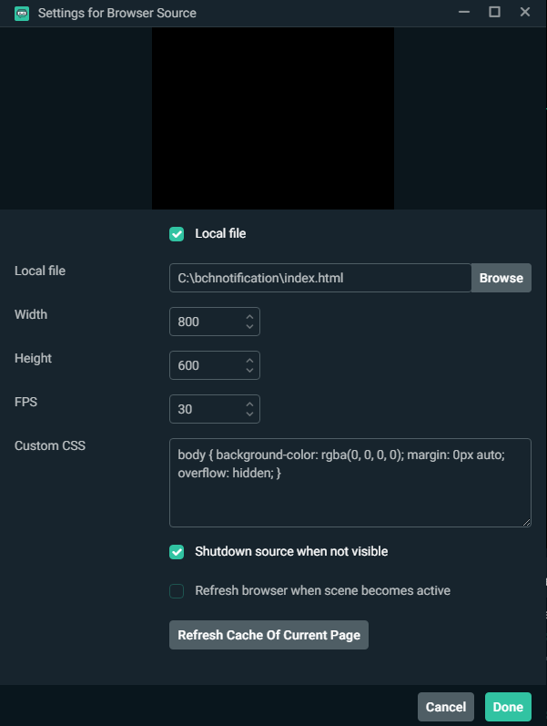

# BCH Notification
A simple notification that monitors a BCH address for incoming transactions. Mainly designed Livestreamers to display BCH donations.

## Getting Started
Quick steps to get started or follow the guide below

- Download this repo as a zip and extract to convenient location
- Edit settings.js (see file for instructions)
- Add to OBS or other streaming studio (local browser source)
- Add a QRCode and/or your address in your streamer profile (https://www.qrcode-monkey.com/ is a great resource to generate a qrcode)
- See those donations roll in!

### Editing Settings
Edit the `settings.js` file to customize your notifications. See configuration instructions below. Be careful not to remove any commas (,) or quotation marks (")

* ***cashaddr*** - type in a Bitcoin Cash (BCH) address you would like donations sent to
* ***units*** - change which units are displayed in the notification - choice of "full", "bits" or "sats"
* ***testmode*** - if true this will show random transactions. this allows you to test notifications without sending any bch to your address.
* ***sound*** - if true a sound will play when you receive a notification/donation

* ***notification***
  * ***message*** - custom message to show on notification
  * ***duration*** - time in milliseconds (1/1000th of a second) the notification will show for
  * ***color*** - color of the notification message (can be any css compatible color code - hex, rgb etc). [Here's a good color picking](https://www.quackit.com/css/css_color_codes.cfm)
  * ***size*** - the size of the notification text in pixels
  * ***font*** - the font to be used for the text. Pick a font from [Google Fonts](https://fonts.google.com/)

#### Settings.js
```
const settings = {
    // Bitcoin cash cashaddr. must be prepended with 'bitcoincash:'
    cashaddr: "bitcoincash:qp8kqqcnklpfhk2vz539cqq3htw2g0sq0qmuaugn0k",
    
    // "full", "bits", "sats"
    units: "full",
    
     // set to true to show random transactions 
    testmode: true,

    // play sound with donation
    sound: true, 
    
    // notification settings
    notification: {

        // donation message. leave blank if no message wanted
        message: "",

        //duration in milisecons (aka 4000 = 4s)
        duration: 4000, 
        
        // name (eg "red"), hex (eg "#FFF") or rgb (eg "rgb(0,0,0,0)")
        color: "red", 

        // font size in pixels
        size: "38", 

        // choose font from - https://fonts.google.com/
        font: "Montserrat"
    }
};
```


### Using Streamlabs OBS
Quick guide on how to integrate with Streamlabs OBS. Just download this repo, unzip it to a convenient location and follow the guide below.

1. Run Streamlabs OBS


2. Click the Plus button and add a Browser source


3. Click "Add New Source" button


4. Click browse and navigate to index.html in this repo


